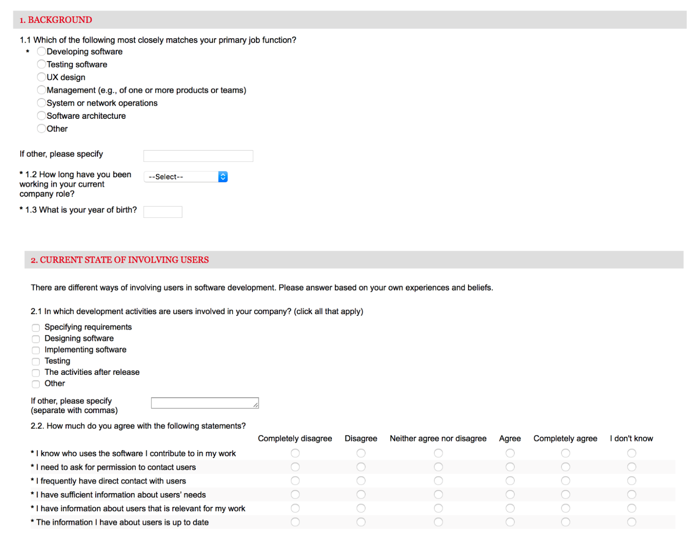

sezin.yaman@helsinki.fi

## Final Assignment
08.03.2017

###1 - General Description and Research Question
This assignment includes the initial analysis of a survey that received 108 responses. The survey was designed to investigate how software companies involve users in their software development. The survey is part of a larger study that aims to improve capabilities for user involvement in software development. The main research question is to examine how methods for involving the users into development can be improved.

Survey in this assignment includes two sections: 1) Background section where the demographics of the resposdents are identified and 2) User involvement state where the current state of the companies are identified. Questions can be seen as below:



###2 - Data Wrangling
Data wrangling is done in Final.R file. Here is how it is look like: 

``` {r}
data <- read.csv("~/Desktop/Open Data Science/IODS-project/data_final.csv")
View(data)
str(data)
dim(data)
```

Variables names are chosen to be descriptive in a way that each of them represents the options under each questions in the survey. Dimensions are 108 * 32 as there are 108 respondents. Various data types are used such as integers, factors and logical variables. 

###3 - Exploration and Analysis Method
Here will explore the dataset further and detail on how it can be analyzed. We start wtih adding the libraries we use and global variables. 

``` {r include = FALSE}
library(foreign)
library(ggplot2)
library(data.table)
library(gmodels)
library(Hmisc)
library(corrplot)
library(reshape2)
POPULATION.SIZE = 108
CURRENTYEAR <- 1900 + as.POSIXlt(Sys.Date())$year
```

To start with the demograhics, we first look at the job functions.
``` {r fig.width=9}
summary(data$jobfunction)
ggplot(data, aes(x=jobfunction)) +
  geom_bar(fill="#FF9999", colour="#FF9999") +
  labs(x="Job function", y="Frequency")
```

We see that majority of the respondents are software developers (36 respondents), followed by managers (24) and people from operations (14) out of total 108. 

Another demographics to look at could be the age distribution of the respondents:

``` {r}
summary(data$age)
ggplot(data, aes(x=age)) + 
  geom_histogram(aes(y=..density..),
                 binwidth=.5,
                 colour="black", fill="white") +
  geom_density(alpha=.2, fill="#FF9999", colour="#FF9999")
``` 

The graph shows that age density is around 50's overall. Next we look at the worktimes for each respondents:

``` {r}
summary(data$worktime)
ggplot(data, aes(x=worktime)) + 
  geom_histogram(aes(y=..density..),# Histogram with density instead of count on y-axis
                 binwidth=10,
                 colour="black", fill="white") +
  geom_density(alpha=.2, fill="#FF9999", colour="#FF9999")  # Overlay with transparent density plot
```

The results portray that the density makes a peak around 30 months, that would be around 2.5 years. The maximum working time seems to be 5 years, that indicates that the company is relatively young. 

After taking a look at the demographic data, let's move on the the next section and start with 2.1 where we will see the activities that users are involved in the company. First, we want to create a data frame for easier exploration:

``` {r include = FALSE}
useractivities.specifying.requirements.count <- sum(data$useractivities.specifying.requirements, na.rm=TRUE)
useractivities.designing.software.count <- sum(data$useractivities.designing.software, na.rm=TRUE)
useractivities.implementing.software <- sum(data$useractivities.implementing.software, na.rm=TRUE)
useractivities.testing <- sum(data$useractivities.testing, na.rm=TRUE)
useractivities.after.release <- sum(data$useractivities.after.release, na.rm=TRUE)
useractivities.other <- sum(data$useractivities.other, na.rm=TRUE)
useractivities <- data.frame(Activity=data$useractivities.options,
                             Frequency=c(
                               useractivities.specifying.requirements.count,
                               useractivities.designing.software.count,
                               useractivities.implementing.software,
                               useractivities.testing,
                               useractivities.after.release,
                               useractivities.other))
```

Now we can explore it with a bar graph:

``` {r fig.width=9}
ggplot(data=useractivities, aes(x=Activity, y=Frequency)) +
  geom_bar(stat="identity", fill="#FF9999", colour="#FF9999")
```

The graph above on user activities (Question 2.1) shows that the activities performed after a software release is the most common stage indicated by the respondents where the users are involved. Specifying the requirements is second most common activity where the users are involved, and it is followed by implementing the software.

Continuing with the responses to Question 2.2 where respondents were asked to rank the statements about user involvement in software development from disagreement to agreement, we again first create an convenient data frame:

``` {r include = FALSE}
userinv <- data.frame(Statement=factor(rep(data$userinv.statements, each=length(data$userinv.S1))),
                      Rating=c(
                        data$userinv.S1,
                        data$userinv.S2,
                        data$userinv.S3,
                        data$userinv.S4,
                        data$userinv.S5,
                        data$userinv.S6))
```

Then we look at the data with a boxplot:

``` {r fig.width=9}
ggplot(data=userinv, aes(x=Statement, y=Rating, fill=Statement)) +
  geom_boxplot() + guides(fill=FALSE) + coord_flip()
```

The figure above shows the statements about general user involvement in the companies vs. the ratings. where 1 is complete disagreement and 5 in complete agreement. We see that it was disagreed that respondents need to ask permission to contact users according to the median, whereas it was agreed that respondents know who uses the software they contribute to in their work. The other statements are on the neutral side, therefore we will need to look deeper into those in the next section. Also, we will try to understand if any significant correlations exist among the job functions, user activities and/or user involvement statements. 

###4 - Further analysis and Interpretations

Here, we can look into more visualizations with multiple variables in order to interpret the survey responses better. For instace, first we look into people who rated for 'user avtivities after release' with regards to job function distributions:

``` {r fig.width=9}
cc <- table(data$jobfunction, data$useractivities.after.release)
cc<-data.frame(cc)
ccc <- cc[cc$Var2 == "TRUE",] 
ggplot(ccc, aes(x=Var1,y=Freq,fill=Var2))+geom_bar(stat="identity") + labs(x="Job functions",y="Frequencies", title="People who marked 'Activities After Release' for user involvement activities") + theme(plot.title = element_text(hjust = 0.5))+guides(fill=FALSE) + theme(plot.title = element_text(lineheight=.6))
```

``` {r fig.width=9}
ggplot(userinv,aes(x=Statement,y=Rating, fill=Rating))+ geom_boxplot(aes(fill = Statement)) + guides(fill=FALSE) + coord_flip() + scale_size_continuous(range = c(0, 70)) + facet_wrap(~data$jobfunction) +  labs(x = "", y = "") #Bu oldu
jb_names <- c(
  'Developing software' = "Developers",
  'Testing software' = "Testers",
  'UX Design' = "UX designers",
  'jobfunction#4' = "Mng",
  'jobfunction#5' = "The",
  'jobfunction#6' = "The O",
  'jobfunction#7' = "The Ot"
)
```

ggplot(data,aes(x=jobfunction,y=age, fill=jobfunction))+geom_boxplot() + guides(fill=FALSE) + coord_flip() #"job function vs. age" 2

dd<-table(data$userinv.S2, jobfunction) # "I neesd permission" over job functions
ggplot(data,aes(x=jobfunction,y=data$userinv.S2, fill=jobfunction))+geom_boxplot() + guides(fill=FALSE) + coord_flip() + labs(x="Roles",y="'I need to ask permission to contact users'")

ggplot(data,aes(x=jobfunction,y=data$userinv.S3, fill=jobfunction))+geom_boxplot() + guides(fill=FALSE) + coord_flip() + labs(x="Roles",y="'I frequently have direct contact with users'") 
